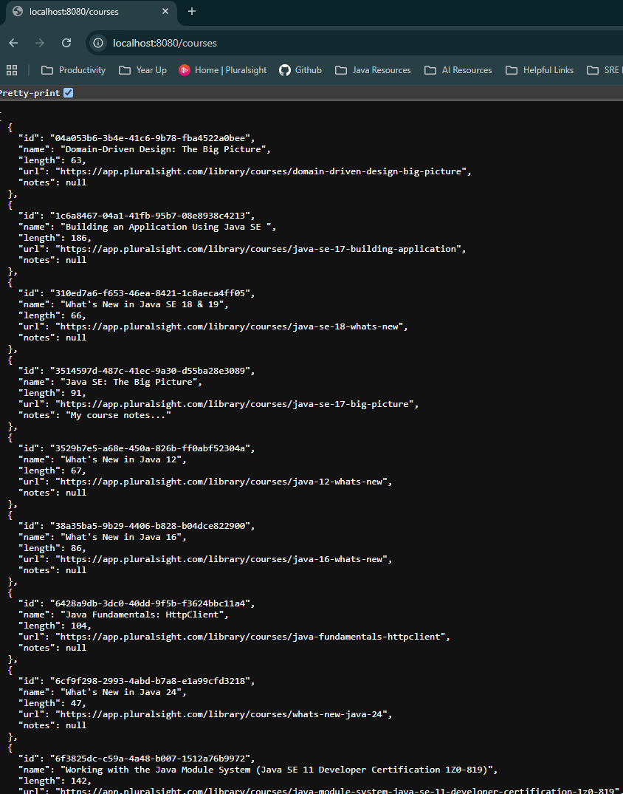

# 📘 Course Info API

A **Java-based course information system** that stores and serves course data through a RESTful API. Built from scratch using core Java and essential libraries — **no frameworks like Spring or Jakarta EE** involved. Designed as a learning project to understand the fundamentals of Java application development, REST APIs, database interaction, and JSON handling.

---

## 🚀 What is Course Info?

- Store interesting tech courses in a local database
- Enrich them with personal notes
- Share them with others through a REST API
- Automatically populate the database with courses from the **Pluralsight API**

---

## 🧱 Project Architecture

This system is split into **three key components**:

1. **CLI Application**
    - Calls the Pluralsight API
    - Parses JSON responses
    - Saves course data into the database

2. **Database**
    - Stores course information
    - Accessed via standard **JDBC** with **H2** (in-memory or file-based)

3. **REST API Server**
    - Built using **JAX-RS / Jersey**
    - Serves course data from the database
    - Supports endpoints to:
        - List all courses (`GET /courses`)
        - Add notes to a course (`POST /courses/{id}/notes`)

---

## 💡 Key Features

- 🛠 **Built with Core Java** – No frameworks like Spring or Quarkus
- 📦 **Modular Design** – CLI tool, API server, and DB are clearly separated
- 🔗 **REST API** – Exposes course data to internal tools or developers
- 📝 **Notes Support** – Add personal notes to any course
- 🔄 **Data Sync** – Automatically fetch courses from Pluralsight by author
- 📄 **JSON Handling** – Uses Jackson for parsing API responses
- ✅ **Tested with JUnit** – Basic testing to validate functionality

---

## 🧰 Technologies Used

| Purpose              | Tool / Library          |
|----------------------|-------------------------|
| Build Tool           | [Maven](https://maven.apache.org/)         |
| JSON Parsing         | [Jackson](https://github.com/FasterXML/jackson)       |
| REST API             | [JAX-RS](https://jakarta.ee/specifications/restful-ws/) with Jersey |
| Database             | [H2](https://www.h2database.com/html/main.html)       |
| Database Access      | JDBC (Core Java)        |
| Testing              | [JUnit](https://junit.org/)          |

---
## 📁 Project Structure
```
CourseInfo/
├── .idea/
├── CourseInfoCLI/
│ ├── pom.xml
│ ├── src/
│ │ ├── main/
│ │ │ ├── java/
│ │ │ │ └── com/pluralsight/CLI/
│ │ │ │ └── service/
│ │ │ │ ├── CourseRetrievalService.java
│ │ │ │ ├── CourseStorageService.java
│ │ │ │ ├── CourseRetriever.java
│ │ │ │ └── PluralsightCourse.java
│ │ ├── resources/
│ │ └── test/
│ └── target/
├── CourseInfoRepository/
│ ├── pom.xml
│ ├── src/
│ │ ├── main/
│ │ │ ├── java/
│ │ │ │ └── com/pluralsight/
│ │ │ │ ├── domain/
│ │ │ │ │ └── Course.java
│ │ │ │ └── repository/
│ │ │ │ ├── CourseJdbcRepository.java
│ │ │ │ ├── CourseRepository.java
│ │ │ │ └── RepositoryException.java
│ │ ├── resources/
│ │ └── test/
│ └── target/
├── CourseInfoServer/
│ ├── pom.xml
│ ├── src/
│ │ ├── main/
│ │ │ ├── java/
│ │ │ │ └── com/pluralsight/server/
│ │ │ │ ├── CourseResource.java
│ │ │ │ └── CourseServer.java
│ │ ├── resources/
│ │ │ └── server.properties
│ │ └── test/
│ └── target/
├── .gitignore
├── CourseInfo.iml
├── courses.db.mv.db
├── db_init.sql
├── dependency-reduced-pom.xml
├── pom.xml # Parent POM
└── README.md
```

## 📷 Screenshots


> **Note:** This app is built for educational purposes and focuses on Java development.
